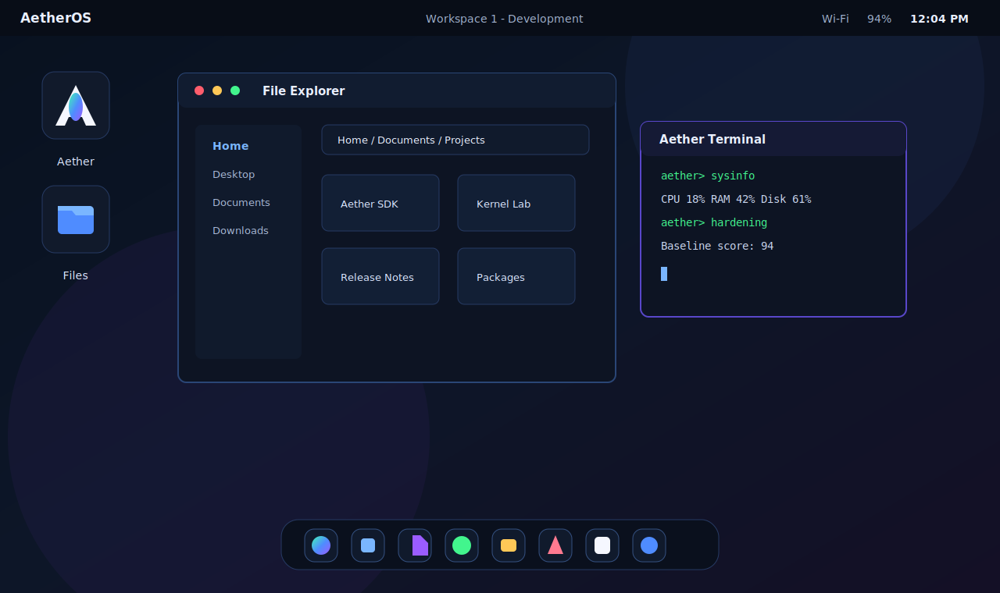
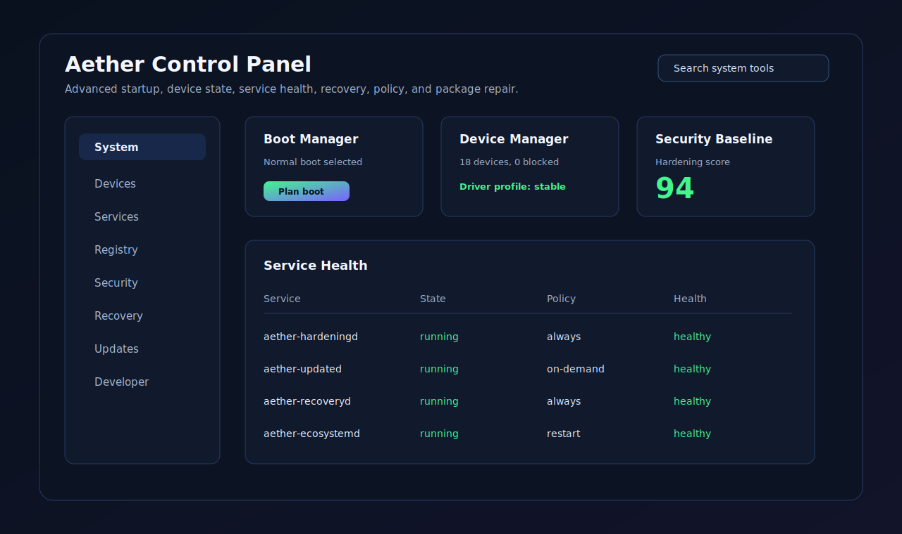
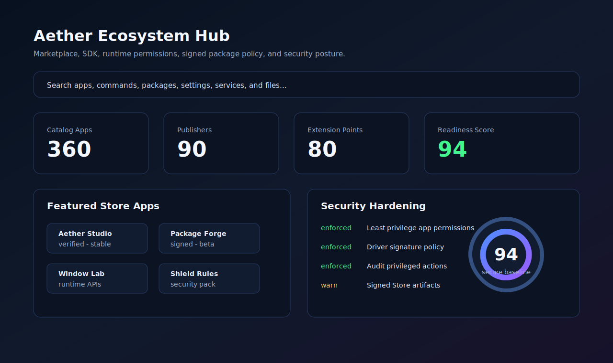

# AetherOS Desktop Shell Foundation

[](release/RELEASE_NOTES_v1.1.2.md)
[](LICENSE)
[](src-tauri/tauri.conf.json)
[](src/main.ts)
[](src-tauri/src/main.rs)
[](docs/security-hardening.md)

AetherOS is the first working foundation of a modern operating-system-style desktop shell. It is a runnable Tauri desktop application with a custom shell UI, an internal window manager, built-in apps, persistent state, Rust-backed filesystem access, live system metrics, a JSON package registry, a backend command bridge, advanced OS research surfaces, and the Aether Nexus command center.

It is not a landing page. It is a prototype shell that can later grow toward a Windows/Linux overlay or a dedicated Linux distribution experience.

## Preview

These preview images show the current shell direction and major built-in surfaces.



| Control Panel | Ecosystem and Security |
| --- | --- |
|  |  |

## Current Status

| Area | Status |
| --- | --- |
| Desktop shell and window manager | Working |
| Built-in apps and command palette | Working |
| Rust-backed filesystem, metrics, packages, search, scanner | Partial |
| Aether Nexus command center | Working |
| Marketplace, app runtime, services, updates, SDK | Prototype |
| Kernel Lab OS research concepts | Prototype |
| Bootable native OS | Future |

See `docs/PROJECT_STATUS.md` and `docs/FEATURE_MATRIX.md` for the detailed breakdown.

## Tech Stack

- Desktop shell: Tauri + Vite
- UI: Vanilla HTML, CSS, and TypeScript
- Core backend: Rust
- Frameworks intentionally not used: React, Next.js, Tailwind

## Install

Install Node.js, Rust, and the Tauri prerequisites for Windows first. Then run:

```powershell
cd AetherOS
npm install
```

## Quick Check

Run the full local verification stack:

```powershell
npm run check
```

That runs TypeScript typecheck, Vite build, and Rust `cargo check --locked`.

## Run Dev Mode

Browser/Vite preview:

```powershell
npm run dev
```

Tauri desktop app:

```powershell
npm run tauri:dev
```

## Build

Frontend build:

```powershell
npm run build
```

Desktop build:

```powershell
npm run tauri:build
```

## Windows Release Artifacts

The current local release build is staged under `release/`:

- `release/AetherOS-1.1.2-windows-x64-setup.exe`: Windows x64 setup installer
- `release/AetherOS-1.1.2-windows-x64-portable.exe`: portable raw Tauri executable
- `release/AetherOS-1.1.2-windows-x64.msi`: Windows x64 MSI installer
- `release/SHA256SUMS.txt`: SHA-256 checksums
- `release/RELEASE_NOTES_v1.1.2.md`: GitHub Release notes draft

Release binaries are intentionally ignored by git. Upload them to GitHub Releases after reviewing the local build.

## Documentation

- `docs/INDEX.md`: Documentation map
- `docs/VISION.md`: Product and platform vision
- `docs/USER_GUIDE.md`: How to use the desktop shell and built-in apps
- `docs/DEVELOPMENT.md`: Project structure, coding rules, app wiring, and implementation workflow
- `docs/DESIGN_SYSTEM.md`: UI rules, layout principles, and app design checklist
- `docs/TESTING.md`: Manual and automated verification checklist
- `docs/TROUBLESHOOTING.md`: Windows, VS Code, Node, Rust, Tauri, and shell troubleshooting
- `docs/PROJECT_STATUS.md`: What is real, simulated, prototype, and next
- `docs/FEATURE_MATRIX.md`: Implementation maturity matrix
- `docs/RFC_PROCESS.md`: Process for large architecture and platform proposals
- `docs/SYSTEM_LAYOUT.md`: Root OS-layer folders, manifests, CLI commands, and validation flow
- `docs/boot-service-orchestration.md`: Boot targets, service plans, CLI commands, and config usage
- `docs/recovery-supervisor.md`: Recovery policy, health diagnosis, snapshots, repairs, and security flow
- `docs/system-operations-expansion.md`: Control Panel operations, event bus, registry, restore points, task scheduler, crash reporter, device manager, and update engine
- `docs/admin-plane.md`: Network, accounts, storage, audit, backup, policy, service, CLI, and UI administration layer
- `docs/windows-plus-ecosystem.md`: Windows-familiar shell behavior plus Aether's own Store, extension, protocol, and publishing ecosystem
- `docs/security-hardening.md`: Secure desktop baseline, hardening service, controls, CLI, threat model, and dependency posture
- `PRIVACY.md`: Local-first prototype privacy policy
- `docs/KEYBOARD_SHORTCUTS.md`: Registered keyboard shortcuts and command routes
- `docs/BACKEND_COMMANDS.md`: Rust/Tauri command bridge reference
- `docs/KERNEL_MODEL.md`: Kernel registry, drivers, device tree, modules, syscalls, interrupts, boot, panic, and power model
- `docs/ARCHITECTURE.md`: Shell, window manager, apps, backend, Nexus, and kernel research architecture
- `docs/PHASE_1_FEATURES.md`: Full completed feature inventory
- `docs/ROADMAP.md`: Completed phases and next-phase direction
- `docs/GITHUB_SETUP.md`: GitHub publishing and repository settings notes

## GitHub

This repository includes GitHub-ready project files:

- `.gitignore` for Node, Vite, Rust/Tauri build output, logs, installers, and local environment files
- GitHub Actions CI for `npm run build` and `cargo check --locked`
- Issue templates for bugs and feature requests
- Pull request template
- `CONTRIBUTING.md`
- `SECURITY.md`
- `CODE_OF_CONDUCT.md`
- `SUPPORT.md`
- `CHANGELOG.md`
- `RELEASE.md`
- `release/README.md`
- `release/RELEASE_NOTES_v1.1.2.md`
- `release/SHA256SUMS.txt`
- `GOVERNANCE.md`
- `MAINTAINERS.md`
- Apache-2.0 `LICENSE`
- `NOTICE`
- `PRIVACY.md`

See `docs/GITHUB_SETUP.md` for recommended repository settings and optional publishing notes. This working copy is intentionally not initialized as a git repository.

## Features

- Full-screen desktop shell with wallpaper, top status bar, clock, network, battery, Action Center, profile, lock screen, workspaces, and launcher controls
- Start Menu 2.0 with pinned apps, recent files, recommended actions, built-in search, and power controls for sleep, restart shell, lock, and shutdown mock
- Taskbar 2.0 with running app badges, per-workspace filtering, hover previews, right-click app menus, and pin/unpin actions
- System tray with background service icons, quick app status, audio/network/power controls, and hidden tray menu
- Real desktop context menu with new folder/file, wallpaper toggle, display settings, sort icons, and refresh shell
- Movable internal windows with open, close, minimize, maximize, focus, drag, resize, snap preview, edge snap, Alt+Tab switching, active highlighting, and saved layout
- App launcher with searchable built-in apps and Start-style recommendations
- Persistent settings, installed packages, notifications, session, and window layout
- File Explorer with Rust-backed known folders, breadcrumbs, search, open, create folder, create file, rename, copy, delete, and folder navigation
- Aether Terminal with command history and commands for help, clear, apps, status, version, package install/remove, theme switching, `ls`, `pwd`, `cd`, `mkdir`, `touch`, `rm`, `sysinfo`, and `processes`
- Settings app with working appearance, animation, dock, developer, shortcuts, audio/display, users, storage, privacy, and performance profile controls
- System Monitor with Rust-backed CPU, RAM, disk, uptime, process list, and live active-window counts
- AetherPkg package manager with installed/available packages, working install/remove/update actions, and a local JSON registry
- VS Code-style command palette opened with Ctrl+K, including apps, theme, lock, settings, package, and diagnostic commands
- Developer Console with shell logs, backend command probes, package registry state, and window layout diagnostics
- App Runtime with `aether.app.json` manifests, permissions, lifecycle, sandboxed iframe app windows, local app store, and API grant flow
- Advanced File Manager with tabs, split view, previews, drag/drop queue, trash, permissions view, recent files, indexed search language, and file associations
- Service Manager with start, stop, restart, boot services, logs, health, restart policy, service permissions, and developer-created services
- Package Registry features for channels, signed packages, dependency display, verification, update history, and rollbacks
- Process controls in System Monitor for kill, suspend request, restart request, resource limits, startup apps, process tree-style listings, and security warnings
- Compositor-grade shell controls for virtual workspaces, tiling, snapping, keyboard workspace switching, and persistent workspace layouts
- Security Center with multiple users, PIN/auth state, app capability grants, encrypted user indicators, admin approval flow, lock widgets, and built-in Aether Shield virus protection
- System Search/indexer for files, apps, settings, commands, packages, services, updates, and recent actions
- Aether SDK center with TypeScript SDK examples, Rust command bridge template, app scaffolder flow, packaging CLI commands, dev-console integration, and example manifests
- Update Center with release channels, changelog, download/apply/rollback flow, and recovery mode
- Aether Control Panel with advanced device manager, services, firewall policy, environment variables, startup apps, repair tools, boot logs, and safe-mode controls
- Real User Profile surfaces with multiple local users, avatar choices, PIN/password language, per-user settings, and per-user app data model
- File Explorer power features with address bar typing, back/forward navigation, properties, open-with, batch queue, favorites language, and existing tabs/split/trash/preview flows
- Aether Marketplace expansion with featured apps, screenshots, reviews, categories, install/update history language, and local developer publishing flow
- Aether Assistant with local command helper actions for opening files, installing `demo-app`, switching gaming mode, opening security, and recovery flows
- Root kernel model in `src/kernelCore.ts` with persistent registry hives, driver configuration, device tree binding, kernel modules, syscall table, interrupt vectors, boot flags, panic policy, power states, and protection-ring view
- Root OS substrate with `kernel/`, `services/`, `drivers/`, `cli/`, `system/`, `config/`, `pkg/`, `security/`, `logs/`, and docs layers
- Root boot target orchestration with minimal, graphical, recovery, and diagnostic targets
- Recovery Supervisor with policy-backed health diagnosis, snapshots, and manifest repair actions
- System operations layer with event bus, service logs, registry hives, restore points, startup apps, task scheduler, crash reporter, driver profiles, device manager data, update manifests, permission requests, and package dependency solving
- Administration plane with Network Center, Account Manager, Storage Manager, Audit Viewer, Backup Manager, Policy Center, protected admin services, system packages, CLI commands, and cross-manifest validation
- Windows-plus experience layer with Start/taskbar/widget/snap/default-app manifests, Experience Center, registered hotkeys, and CLI reporting
- Aether ecosystem layer with Store channels, verified apps, shell extension points, app protocols, developer publishing, protected services, protected packages, and Ecosystem Hub
- Security hardening layer with default-deny runtime posture, Store signature policy, shell extension review gates, audit requirements, threat model, hardening CLI, and Security Center posture panel
- Graphical Boot Manager, Aether Registry, Device Manager, Permission Prompt Center, Aether Task Scheduler, Crash Reporter, and Event Viewer apps
- Aether CLI tooling for `doctor`, `status`, `targets`, `boot plan`, `boot apply`, `recovery status`, `recovery snapshot`, `recovery restore`, `recovery points`, `pkg solve`, `events`, `service logs`, `registry`, `startup`, `tasks`, `updates`, `crash bundle`, `kernel`, `services`, `drivers`, `packages`, config inspection, service/driver/package state changes, and structured system logs
- Aether Kernel Lab as the UI control surface for that root kernel model plus interactive prototypes for Single Address Space OS design, protection domains, transparent compatibility VMs, formal verification, semantic database-style filesystem queries, deterministic record/replay debugging, object-capability security, zero-copy IPC, reactive kernel streams, live-patchable components, hardware acceleration, Round Robin, MLFQ, CFS-style virtual runtime scheduling, AI-augmented scheduling, eBPF-style safe bytecode, ZRAM-style memory compression, VFS/versioned filesystem ideas, namespaces, game containers, and OSDev resources
- Aether Nexus command center with live system graph, launchable workspace modes, automation rules, self-healing diagnostics, time ribbon, command mesh, and Ctrl+Shift+X shortcut
- Native App Runtime v2 foundations: app install folder, manifest loading from disk, Tauri multi-webview launch hook, permission prompts, API bridge, and crash handling messages
- Rust-backed SQLite filesystem search index with background-style reindex command, metadata cache, and file search results
- Real Aether Trash folder with move-to-trash, restore, permanent delete, copy/move queue display, and conflict-ready queue model
- System Storage and Privacy settings with storage paths, cache clear, shell reset, export/import state, permission audit, and app data management
- Native Web Notification bridge with permission request, do-not-disturb, history, and app notification controls
- Local `.aetherpkg` package file install path with manifest validation, dependency messaging, signature placeholder verification, and rollback snapshot messaging
- Workspace Overview/Mission Control with all windows across workspaces, move-to-workspace controls, workspace templates, and persistent layouts
- Boot/startup experience with splash screen, service startup sequence, login handoff, startup app restore, and boot logs
- Aether Shield real scanner with SHA-256 hashing, suspicious extension/name rules, quarantine folder, scan history, and watch-mode placeholder
- Design system pass with stronger keyboard focus states, consistent platform panels, empty/error/loading copy, and small-window polish
- Rust/Tauri commands wired to the frontend for state, filesystem, packages, metrics, processes, OS version, and diagnostics

## Known Prototype Limitations

- GPU telemetry remains simulated and clearly labeled.
- Package registry is local JSON, not a signed remote registry yet.
- Login is a local shell lock/unlock flow, not an operating-system credential provider.
- Third-party apps run in sandboxed iframe windows for Phase 3; native multi-webview app isolation is the next Tauri runtime step.
- Native app webview launch currently opens an isolated Tauri shell webview hook; fully loading each app's own bundled HTML into that webview is the next runtime refinement.
- Aether Shield scans files with local rules and hashes suspicious files, but it is not a kernel-mode antivirus driver.
- App sandboxing, real services, and boot integration are future work.
- Boot targets currently update root manifests and service/driver state; they are not yet wired to native OS boot.
- Recovery Supervisor repairs AetherOS project manifests, not the host Windows installation.
- Event bus, task scheduler, update engine, crash reporter, registry editor, and device manager are AetherOS substrate models and UI tools; native OS integration is a future Rust/Tauri step.
- Kernel Lab models advanced OS concepts in the desktop shell; it is not yet a bootable AetherOS kernel or kernel-mode implementation.
- Compatibility VM work is modeled as transparent app/game compatibility and isolation. The project does not implement stealth anti-cheat bypassing.
